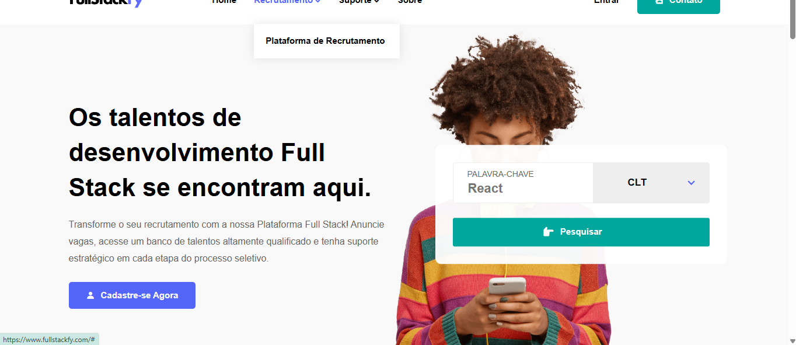
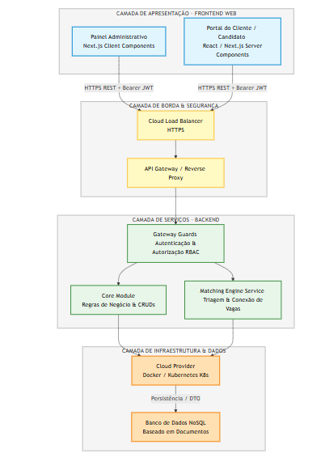

## Desafios técnicos que resolvi

### 1. **Data Masking e Migração Segura entre Ambientes (LGPD)**
Desenvolvi um script de automação para mascaramento de dados sensíveis (Data Masking) de produção antes da migração para os ambientes de homologação e desenvolvimento. Atuei sob supervisão do arquiteto do projeto, sendo responsável pela implementação completa da lógica. Após a execução de testes e ajustes de integração, a solução entrou em produção.

**Resultados:** Garantindo conformidade com a LGPD e a segurança dos dados dos usuários.

**Stack envolvida:** Node.js, Firebase Admin SDK, Firestore, GCP (Google Cloud Platform)
**Código:** [`/scripts/`](./scripts/)  
**Como testar:** `cd scripts && docker-compose up -d && npm start`

### 2. **Sincronização de Estado entre Componentes no Next.js**
Corrigi um bug crítico onde as validações de formulário feitas no componente pai não refletiam no componente filho, eliminando gargalos de UX. Diagnostiquei que o problema era a falta de uma _Single Source of Truth_ (Fonte Única de Verdade) devido à duplicação de estado. Refatorei a estrutura aplicando o padrão de **Componente Controlado**, centralizando o estado de validação no componente pai e propagando os dados de forma previsível via props.

**Resultados:** Formulário 100% consistente, eliminação de bugs de renderização e melhora na experiência do usuário.

**Stack envolvida:** React, Next.js, TypeScript.
**Código do Desafio:** [`/examples/controlled-form/`](./examples/)
**Como testar:** `cd examples/controlled-form && npm install && npm run dev`

## Sobre o Projeto

Atuei por 1 ano como Desenvolvedora Full Stack na construção e sustentação de uma plataforma web escalável voltada para o ecossistema de recrutamento técnico (conexão entre desenvolvedores e recrutadores).

### Interface v1

Primeira versão da home:

## Arquitetura

A plataforma foi estruturada em microsserviços totalmente conteinerizados e hospedados na Google Cloud Platform (GCP):

**Principais decisões técnicas:**

* **Next.js:** Adotado no ecossistema do frontend para garantir renderização híbrida e indexação (SEO) das páginas de vagas públicas.

* **NestJS (Cloud Run):** APIs RESTful robustas estruturadas em arquitetura modular com autoscaling automático orientado à demanda.

* **Firestore:** Banco de dados NoSQL para modelagem flexível de perfis de candidatos e consultas de baixa latência.

* **Kubernetes (G8s/GKE):** Orquestração e gerenciamento de filas e workers assíncronos em background (ex: processamento de e-mails em massa).